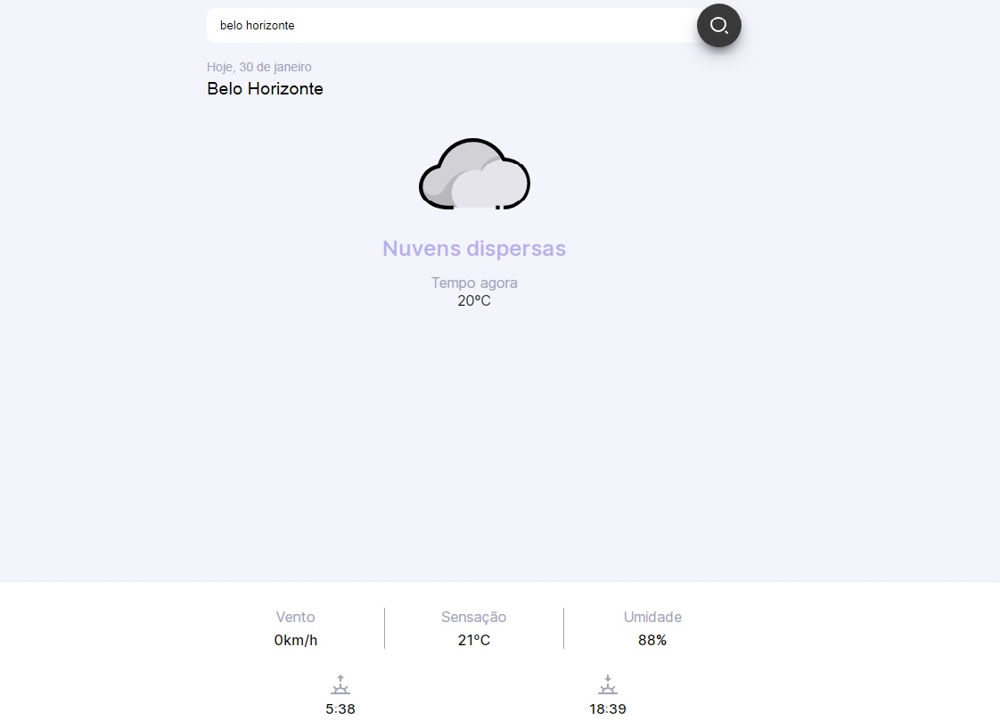

<h1 align="center"> Snapclima </h1>

O Snapclima é um app para se informar sobre o clima no momento atual de onde quiser!  

  <a href="#-tecnologias">Tecnologias</a>&nbsp;&nbsp;&nbsp;|&nbsp;&nbsp;&nbsp;
<<<<<<< HEAD
  <a href="#-projeto">Projeto</a>&nbsp;&nbsp;&nbsp;|;&nbsp;&nbsp;
=======
  <a href="#-projeto">Projeto</a>&nbsp;&nbsp;&nbsp;|&nbsp;&nbsp;&nbsp;
>>>>>>> 3854564d66c5f04ab77fba9a3ab650cf93964478

 

  

## 🚀 Tecnologias

Esse projeto foi desenvolvido com as seguintes tecnologias:

- HTML e CSS
- JavaScript
- Git e Github
- metodologia Block, Element, Modifier (BEM)

## 💻 Projeto

O Snapclima foi um projeto muito legal de fazer, onde eu usei a metodologia BEM para ajudar os desenvolvedores a entender melhor a relação entre o HTML e o CSS do projeto,o Javascript tabem foi bem estruturado fazendo com que esse app possa trazer informações valiozas do clima no dia a dia, a qualquer hora, em qualquer lugar de forma simples!

- [Visite o projeto online](https://lorenaop.github.io/snapclima/)

<<<<<<< HEAD

=======
>>>>>>> 3854564d66c5f04ab77fba9a3ab650cf93964478
